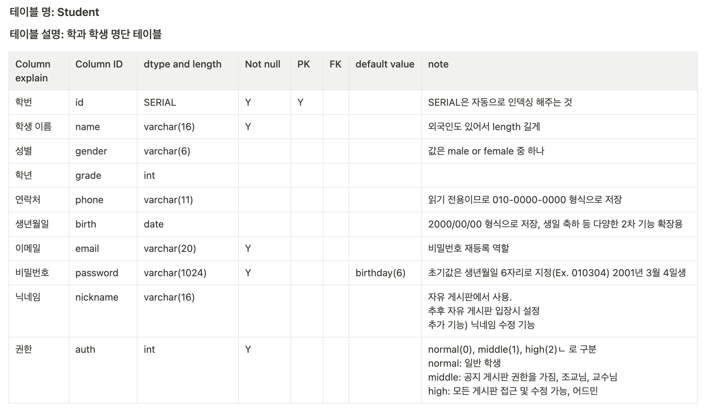

# 데이터베이스 연동 기록

## 목표

> 리눅스 환경에서 PostgreSQL을 사용해 테이블을 생성해보자.

## 어드민 권한으로 sql 접속하기

- PostgreSQL 에서는 postgre 라는 유저가 기본적으로 생성되어 있다.
- postgre 유저는 슈퍼 권한을 포함한 모든 권한을 가지고 있다.
- 따라서 postgre 유저를 통해 다른 유저나 데이터베이스를 생성할 수 있다.

## postgre 유저로 sql 접속하기

```bash
sudo -u postgres psql
```

- 해당 명령어를 입력하면 아래와 같이 sql에 접속 가능하다.

```sql
postgres=#
```

## 새로운 유저 생성

### 1. 유저 목록 확인

```bash
postgres=# \du
                          롤 목록
 롤 이름  |                      속성
----------+------------------------------------------------
 postgres | 슈퍼유저, 롤 만들기, DB 만들기, 복제, RLS 통과
```

- du 명령어를 입력하면, 모든 유저와 유저의 권한(role) 목록을 볼 수 있다.

### 2. 유저 생성하기

```bash
postgres=# CREATE ROLE CSEPAGE SUPERUSER;
CREATE ROLE
```

```bash
postgres=# \du
                          롤 목록
 롤 이름  |                      속성
----------+------------------------------------------------
 csepage  | 슈퍼유저
 postgres | 슈퍼유저, 롤 만들기, DB 만들기, 복제, RLS 통과
```

- 해당 명령어를 입력하면, 유저가 생성된다.
- csepage라는 유저의 권한이 SUPERUSER 라는 의미이다.

### 3. 생성된 유저 로그인 가능하도록 변경

```bash
postgres=# ALTER ROLE CSEPAGE WITH LOGIN;
ALTER ROLE
```

- 이렇게하면 이제 유저 생성과 해당 유저로 로그인 할 수 있게 되었다.

## CSEPAGE 데이터베이스 생성

```bash
postgres=# \du
                          롤 목록
 롤 이름  |                      속성
----------+------------------------------------------------
 csepage  | 슈퍼유저
 postgres | 슈퍼유저, 롤 만들기, DB 만들기, 복제, RLS 통과
```

- 현재 데이터베이스 생성의 권한은 postgres 유저 밖에 없기 때문에 데이터베이스를 생성한다.

```bash
postgres=# CREATE DATABASE CSEPAGE;
CREATE DATABASE
```

- 모두 생성을 했다면 아래의 명령어를 입력해 종료한다.

```bash
\q
```

## 유저 비밀번호 설정

> 데이터베이스의 접근 시에는 유저명과 유저 비밀번호, 데이터베이스 명이 필수이다.

### 1. csepage 유저로 로그인

- PostgreSQL은 현재 리눅스에 로그인된 사용자의 이름을 유저명으로 사용가능하다.

```bash
csepage@seolak:~$ psql
csepage=#
```

- 따라서 위의 명령어를 실행하면, 현재 리눅스 유저와 같은 'csepage' 유저로 SQL이 실행된다.

### 2. 비밀번호 설정

```bash
csepage=# ALTER USER CSEPAGE PASSWORD 'csepage20';
ALTER ROLE
```

- 해당 유저는 이제 'csepage' 유저명을 가지고, 'csepage20' 이라는 비밀번호를 가진다.

## 데이터베이스 테이블 생성

### 1. 데이터베이스 명세서

> 명세서는 아래와 같다.



### 2. 명세서를 SQL 문으로

```sql
CREATE TABLE STUDENT (
ID SERIAL PRIMARY KEY,
NAME VARCHAR(16) NOT NULL,
GENDER VARCHAR(6) CHECK(GENDER IN('MALE', 'FEMALE')),
GRADE INT,
PHONE VARCHAR(11) CHECK(PHONE ~ '010-[0-9]{4}-[0-9]{4}'),
BIRTH DATE,
EMAIL VARCHAR(20) NOT NULL,
PASSWORD VARCHAR(1024),
NICKNAME VARCHAR(16),
AUTH INT NOT NULL CHECK(AUTH IN (0, 1, 2))
);
```

- PostgreSQL에서는 default 키워드가 없기 때문에 약간의 변경을 해서 테스트 테이블을 생성한다.
- 생성 결과는 아래와 같다.

```sql
csepage=# SELECT * FROM STUDENT;
 id | name | gender | grade | phone | birth | email | password | nickname | auth
----+------+--------+-------+-------+-------+-------+----------+----------+------
(0개 행)
```
